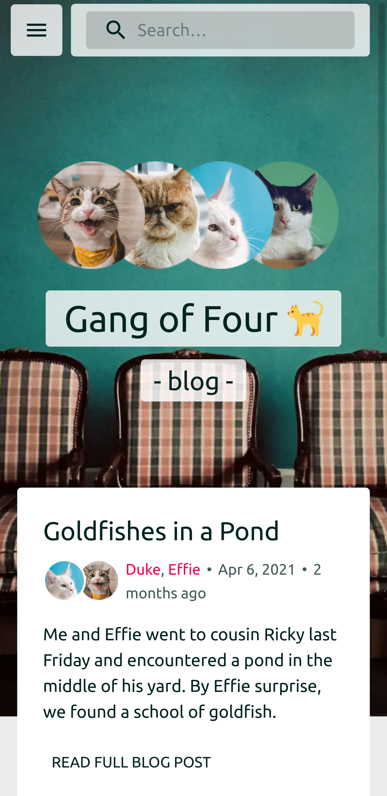

<h1 align="center">
  Gang of Four
</h1>

  🐈🐈🐈

  Sample website for testing Gatsby & other things

  
  

<h2>About</h2>

  You have come across a sample website. This is supposed to be a website to test a few of Gatsby features and integrations including Contentful, Netlify, SEO optimzations & more. All images were taken from Unplash and Wikipedia.

<h2>Features</h2>

- Gatsby for SSG and optimizations
- Contentful as a headless CMS for content generation and management
- Algolia for searching and indexing
- Netlify as the static website hosting alternative
- Google Analytics
- Material UI

<h2>Screenshots</h2>

<h3>v1.1</h3>

 

 

 

<h3>v1</h3>

 

<h3>Thanks!</h3>
